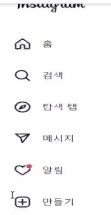
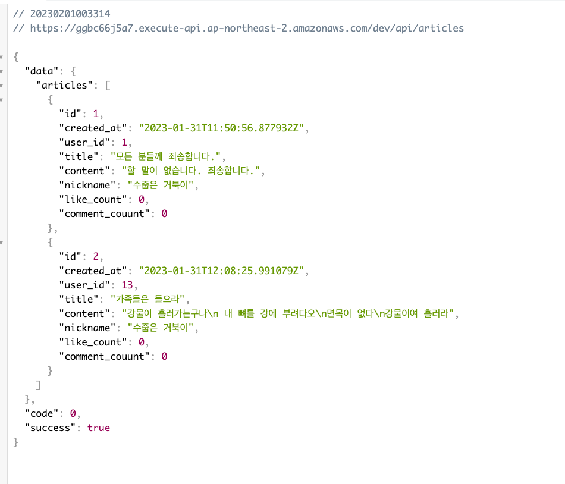

# will paper

## 페이지
- `/` 메인 페이지 (게시물 list)
- `articles/:articleId` 게시물 상세 페이지

## 사이드바 예시



## 피드 페이지
- 닉네임, 유저 아바타, 옵션버튼
- 제목, 본문내용
- 좋아요 수, 좋아요 하기, 댓글창, 공유하기

> 글쓰기, 댓글 달기는 modal 창을 띄워서 작성하기

## API
게시물, 댓글 CRUD, 추천하기
### 게시물 (articles)
- GET `/api/articles`
- POST `/api/articles`
- PUT `/api/articles/:articleId`
- DELETE `api/articles/:articleId`
### 댓글 (comments)
- GET /api/comments
- POST /api/comments
- PUT /api/comments/commentId
- DELETE api/comments/commentId

### 추천하기
- PUT `api/articles/articleId/like`
- PUT `/api/comments/:commentId/like`
### api 예시
https://ggbc66j5a7.execute-api.ap-northeast-2.amazonaws.com/dev/api/articles


```json
{
  "data": {
    "articles": [
      {
        "id": 1,
        "created_at": "2023-01-31T11:50:56.877932Z",
        "user_id": 1,
        "title": "모든 분들께 죄송합니다.",
        "content": "할 말이 없습니다. 죄송합니다.",
        "nickname": "수줍은 거북이",
        "like_count": 0,
        "comment_couunt": 0
      },
      {
        "id": 2,
        "created_at": "2023-01-31T12:08:25.991079Z",
        "user_id": 13,
        "title": "가족들은 들으라",
        "content": "강물이 흘러가는구나\n 내 뼈를 강에 부려다오\n면목이 없다\n강물이여 흘러라",
        "nickname": "수줍은 거북이",
        "like_count": 0,
        "comment_couunt": 0
      }
    ]
  },
  "code": 0,
  "success": true
}
```
> 유저 인증 없음
> ip 와 user-agent 를 바탕으로 익명의 유저 닉네임 생성(ex수줍은 거북이)

## Model

### article
- id
- user_id
- nickname
- title
- content
- is_secret
- secret_question
- secret_answer
- comment_count
- like_count
- created_at

### comment 
- id
- user_id
- nickname
- content
- like_count
- created_at